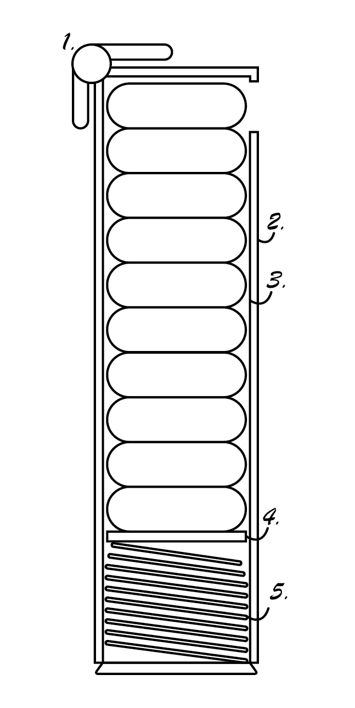
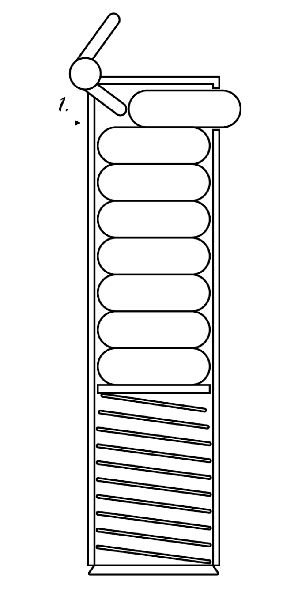
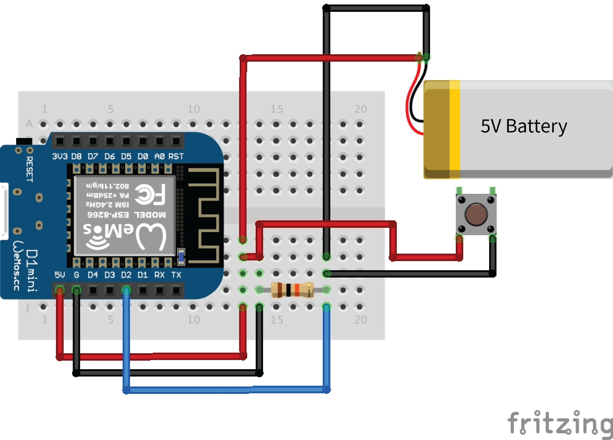

# pill-E
A smart pill dispenser that tracks medical dosage intake and reminds you up keep up with your meds!

---
### Mechanical Design
The mechanical design of pill-E is inspired by Pez candy dispensers. The following image is a sketch of this design, including key components of the dispensing mechanism (numbered):

A spring (5) at the bottom of the interior compartment (3) is situated on top of a support plate (4) for the pills. The pills are easily loaded into the interior compartment as it slides out of the exterior compartment (2) from the bottom. The dispensing mechanism on top (1) works by using a simple lever to push out one pill at a time as further exemplified in the following image.

As seen in the image above, as the lever is pushed up, a pill is easily popped out. The electrical design for pill-E will detect this pushing motion via a button, to determine the exact moment a pill has been dispensed. The arrow on the diagram is pointing to a gap (1) in the back cover of the design (unseen due to side perspective), that allows the lever to make contact with the pill.

---
### Wiring Diagram
The following image shows the wiring diagram for data recording component of pill-E. 

A simple push button will be mounted onto the dispensing lever, which will be pushed everytime a pill is dispensed. The exact moment the button is pushed is recorded by the WEMOS D1 mini microcontroller, which relays this information to a web application via WiFi. The entire circuit is charged by a 5V battery.

---
### Next Steps
I am currently working on the CAD model of the mechanical build for 3-D printing, including additional components to safely mount all electronic parts. Programming the main circuit is underway as well. After these two steps, I can begin on the web application and ensuring that the WiFi communication between the board and application are working seamlessly.
